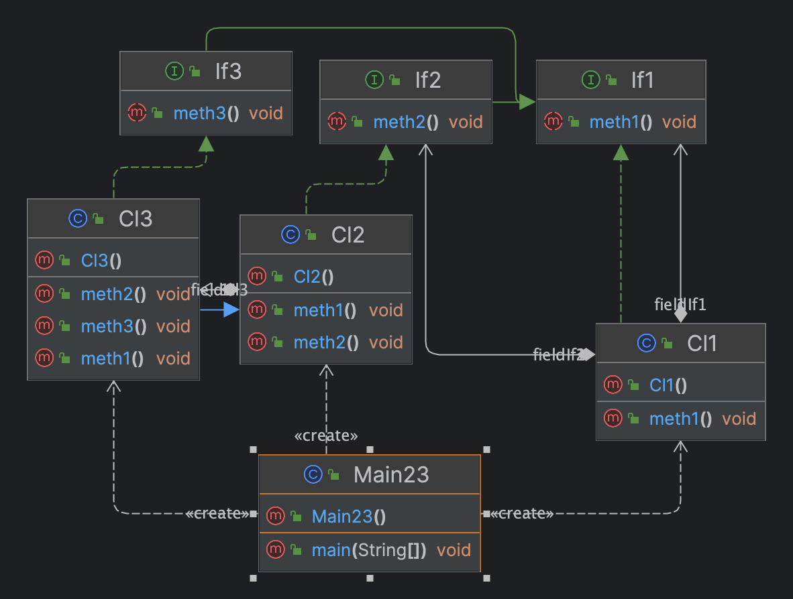
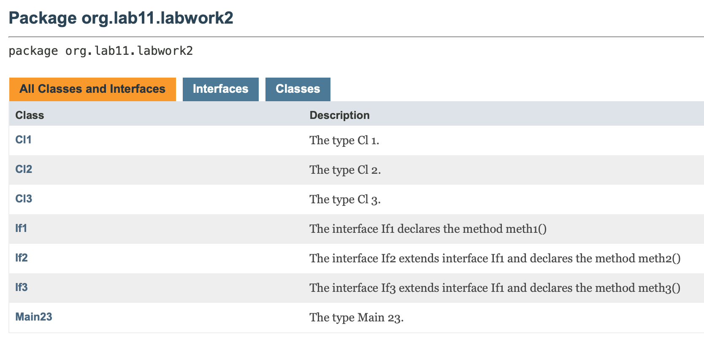

# Лабороторна робота №2. Графічна нотація UML, Документовання проекту.

> **Мета:** Ознайомлення з видами діаграм UML. Отримання базових навичок з
використання діаграми класів мови UML. Здобуття навичок з
використання засобів автоматизації UML-моделювання на прикладі
ArgoUML/Umbrello. Документування проекту за допомогою JavaDoc.

# Інструкція з запуску проекту.

Спочатку склонуйте репозиторій з відповідним проектом на ваш комп'ютер:

```bash
git clone https://github.com/
```
Потім перейдіть в каталог проекту:

```bash
cd /JavaLabs
```
Завантажте всі залежності Maven і зіберіть проект:
```bash
mvn clean install
```

Запустіть головний класс:
```bash
java -classpath target/classes org.lab11.labwork2.Main23
```

### UML Діаграма


### Javadocs



