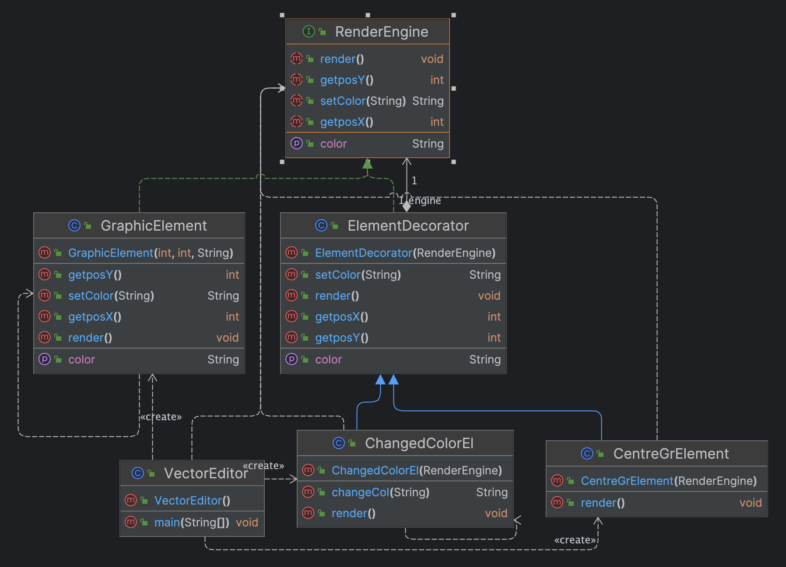
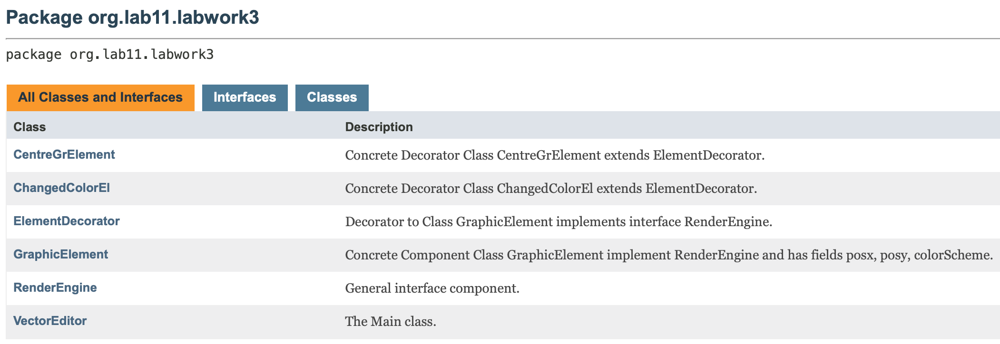

# Лабороторна робота №3. СТРУКТУРНІ ШАБЛОНИ ПРОЕКТУВАННЯ. ШАБЛОНИ COMPOSITE, DECORATOR, PROXY

> **Мета:** Ознайомлення з видами шаблонів проектування ПЗ. Вивчення
структурних шаблонів. Отримання базових навичок з застосування
шаблонів Composite, Decorator та Proxy.

### Завдання:
5. Визначити специфікації класів та реалізацію методів для подання
   вибраного графічного елементу у редакторі векторної графіки.
   Забезпечити можливість динамічної зміни відображення елементу.

# Інструкція з запуску проекту.

Спочатку склонуйте репозиторій з відповідним проектом на ваш комп'ютер:

```bash
git clone https://github.com/Dementris/JavaLab
```
Потім перейдіть в каталог проекту:

```bash
cd /JavaLabs
```
Завантажте всі залежності Maven і зіберіть проект:
```bash
mvn clean install
```

Запустіть головний класс:
```bash
java -classpath target/classes org.lab11.labwork3.VectorEditor
```

### UML Діаграма


### Javadocs



