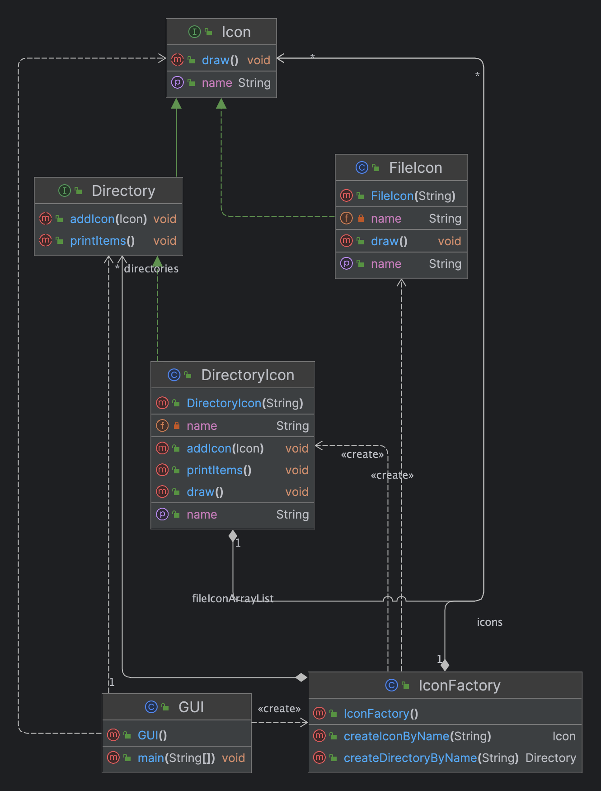

# Лабороторна робота №4. СТРУКТУРНІ ШАБЛОНИ ПРОЕКТУВАННЯ. ШАБЛОНИ FLYWEIGHT, ADAPTER, BRIDGE, FACADE

> **Мета:** Вивчення структурних шаблонів. Отримання базових навичок з
застосування шаблонів Flyweight, Adapter, Bridge, Facade.

### Завдання:
3. Визначити специфікації класів, які подають об'єкти-іконки для
   зображення елементів файлової системи при побудові графічного
   інтерфейсу користувача (GUI) – примітиви (файли) та їх композиції (директорії). Забезпечити ефективне використання пам'яті при роботі з
   великою кількістю графічних об'єктів. Реалізувати метод рисування графічного об'єкту.
# Інструкція з запуску проекту.

Спочатку склонуйте репозиторій з відповідним проектом на ваш комп'ютер:

```bash
git clone https://github.com/Dementris/JavaLab
```
Потім перейдіть в каталог проекту:

```bash
cd /JavaLabs
```
Завантажте всі залежності Maven і зіберіть проект:
```bash
mvn clean install
```

Запустіть головний класс:
```bash
java -classpath target/classes org.lab11.labwork4.GUI
```

### UML Діаграма



