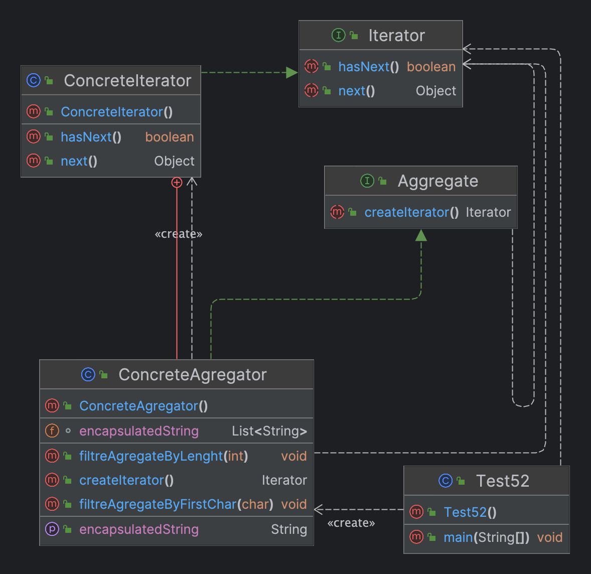

# Лабороторна робота №3. СТРУКТУРНІ ШАБЛОНИ ПРОЕКТУВАННЯ. ШАБЛОНИ COMPOSITE, DECORATOR, PROXY

> **Мета:** Вивчення шаблонів поведінки. Отримання базових навичок з
застосування шаблонів Iterator, Mediator та Observer.

### Завдання:
2. Визначити специфікації класів які інкапсулюють лінійний список
   символьних рядків та реалізують можливість звичайного послідовного
   обходу та обходу з додатковою фільтрацію агрегату
# Інструкція з запуску проекту.

Спочатку склонуйте репозиторій з відповідним проектом на ваш комп'ютер:

```bash
git clone https://github.com/Dementris/JavaLab
```
Потім перейдіть в каталог проекту:

```bash
cd /JavaLabs
```
Завантажте всі залежності Maven і зіберіть проект:
```bash
mvn clean install
```

Запустіть головний класс:
```bash
java -classpath target/classes org.lab11.labwork4.GUI
```

### UML Діаграма



