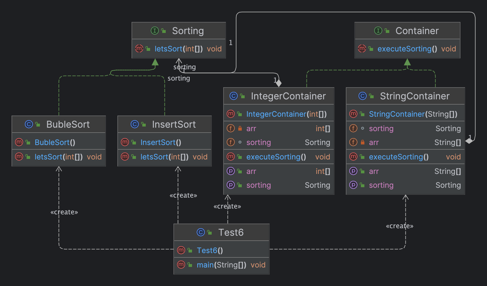

# Лабороторна робота №6. ШАБЛОНИ ПОВЕДІНКИ. ШАБЛОНИ STRATEGY, CHAIN OF RESPONSIBILITY, VISITOR

> **Мета:** Вивчення шаблонів поведінки. Отримання базових навичок з
застосування шаблонів Strategy, Chain of Responsibility та Visitor.

### Завдання:
3. Визначити специфікації класів, що реалізують контейнери для цілих
   чисел та текстових строк з можливістю їх сортування. Забезпечити
   можливість динамічної зміни алгоритму сортування шляхом зовнішньої
   параметризації. Реалізація алгоритму сортування має бути незалежною
   від типу даних, що сортуються.
# Інструкція з запуску проекту.

Спочатку склонуйте репозиторій з відповідним проектом на ваш комп'ютер:

```bash
git clone https://github.com/Dementris/JavaLab
```
Потім перейдіть в каталог проекту:

```bash
cd /JavaLabs
```
Завантажте всі залежності Maven і зіберіть проект:
```bash
mvn clean install
```

Запустіть головний класс:
```bash
java -classpath target/classes org.lab11.labwork4.GUI
```

### UML Діаграма



