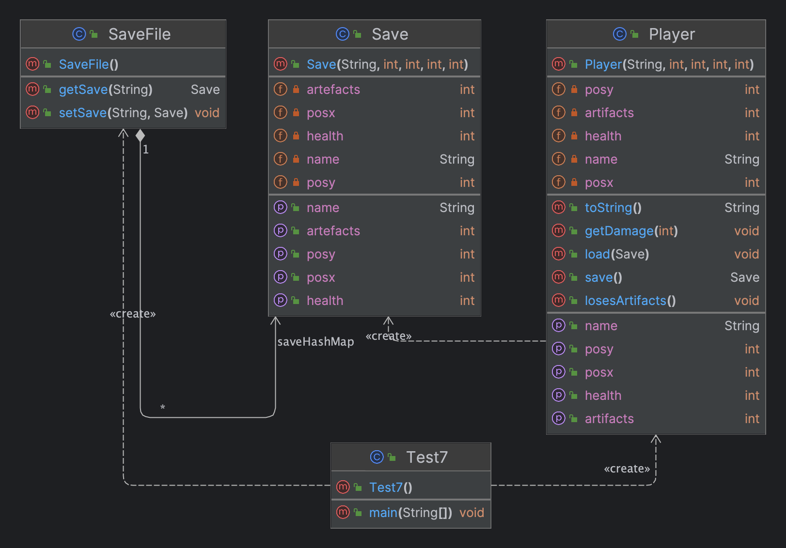

# Лабороторна робота №6. ШАБЛОНИ ПОВЕДІНКИ. ШАБЛОНИ MEMENTO, STATE, COMMAND, INTERPRETER

> **Мета:** Вивчення шаблонів поведінки. Отримання базових навичок з
застосування шаблонів Memento, State, Command та Interpreter.

### Завдання:
1. Визначити специфікації класу, що подає персонажа в ігровому просторі з
   необхідними атрибутами (позиція персонажу, склад артефактів, рівень
   "здоров'я" тощо). Реалізувати механізм збереження/встановлення стану
   персонажа.
# Інструкція з запуску проекту.

Спочатку склонуйте репозиторій з відповідним проектом на ваш комп'ютер:

```bash
git clone https://github.com/Dementris/JavaLab
```
Потім перейдіть в каталог проекту:

```bash
cd /JavaLabs
```
Завантажте всі залежності Maven і зіберіть проект:
```bash
mvn clean install
```

Запустіть головний класс:
```bash
java -classpath target/classes org.lab11.labwork4.GUI
```

### UML Діаграма



