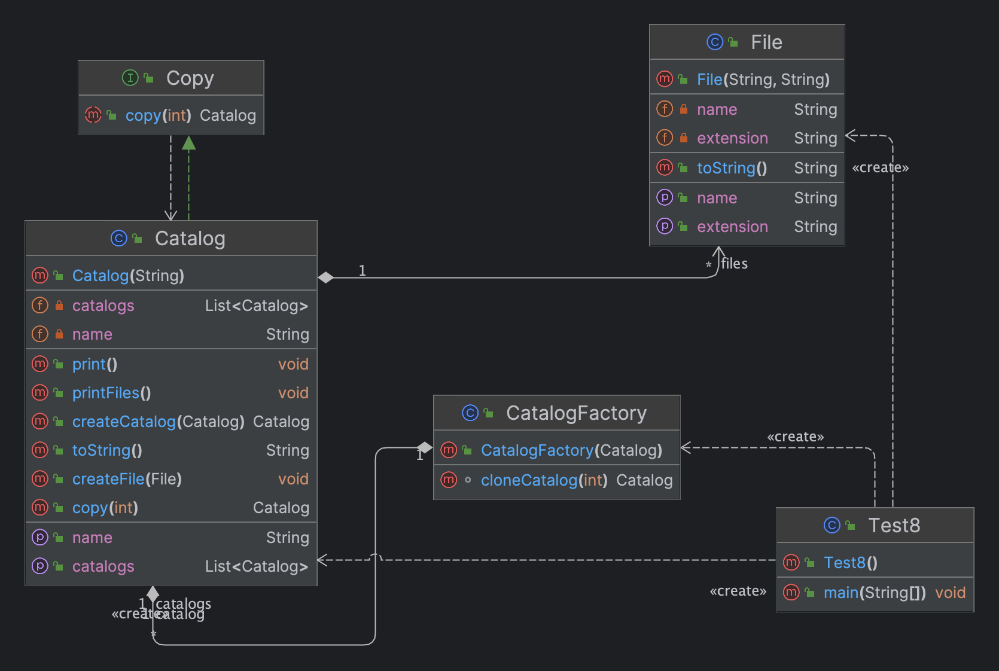

# Лабороторна робота №8. ПОРОДЖУВАЛЬНІ ШАБЛОНИ. ШАБЛОНИ PROTOTYPE, SINGLETON,

FACTORY METHOD
> **Мета:** Вивчення породжувальних шаблонів. Отримання базових навичок з
застосування шаблонів Prototype, Singleton та Factory Method.

### Завдання:
3. Визначити специфікації класів для подання файлової системи у вигляді
   дерева об'єктів (файл - листовий об'єкт, каталог - вузловий). Реалізувати
   механізм клонування таких об'єктів з параметром глибини.
# Інструкція з запуску проекту.

Спочатку склонуйте репозиторій з відповідним проектом на ваш комп'ютер:

```bash
git clone https://github.com/Dementris/JavaLab
```
Потім перейдіть в каталог проекту:

```bash
cd /JavaLabs
```
Завантажте всі залежності Maven і зіберіть проект:
```bash
mvn clean install
```

Запустіть головний класс:
```bash
java -classpath target/classes org.lab11.labwork4.GUI
```

### UML Діаграма



