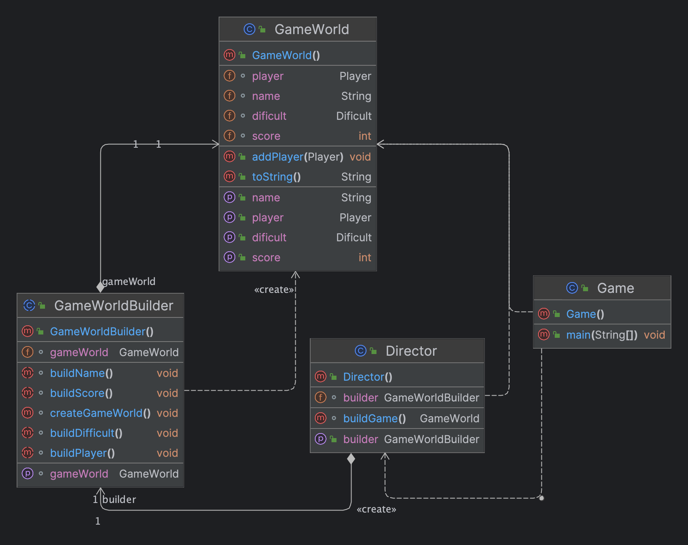

# Лабороторна робота №8. ПОРОДЖУВАЛЬНІ ШАБЛОНИ. ШАБЛОНИ ABSTRACT FACTORY,

BUILDER

FACTORY METHOD
> **Мета:** Вивчення породжувальних шаблонів. Отримання базових навичок з
застосування шаблонів Abstract Factory та Builder.

### Завдання:
3. Визначити специфікації класів для прямокутного ігрового простору та
   завантажувача його конфігурації із зовнішнього файлу.
# Інструкція з запуску проекту.

Спочатку склонуйте репозиторій з відповідним проектом на ваш комп'ютер:

```bash
git clone https://github.com/Dementris/JavaLab
```
Потім перейдіть в каталог проекту:

```bash
cd /JavaLabs
```
Завантажте всі залежності Maven і зіберіть проект:
```bash
mvn clean install
```

Запустіть головний класс:
```bash
java -classpath target/classes org.lab11.labwork4.GUI
```

### UML Діаграма



